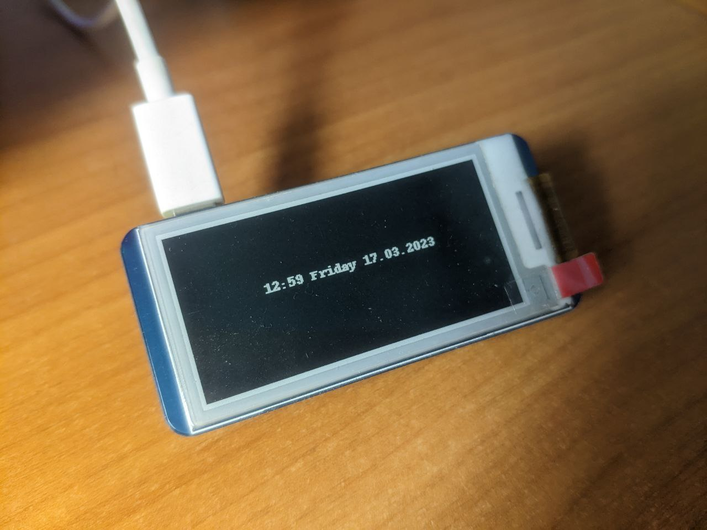
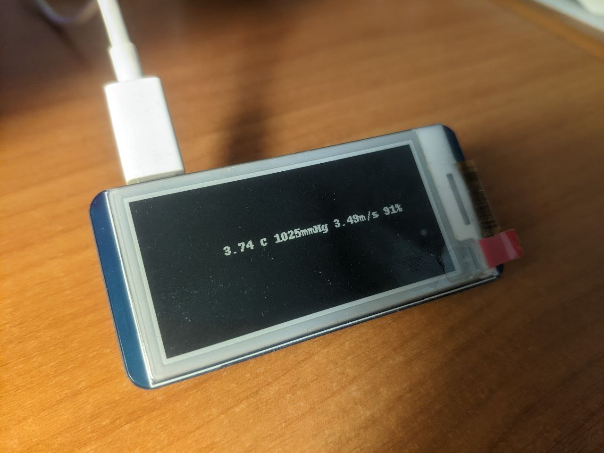

# Raspberry Pi waveshare e-ink display drivers wrapper
## WIP

## Requirements

* Python 3.10+
* RPi.GPIO 0.7.x
* spidev 3.6

## Install this application
```
python3 -m venv venv
pip install -r requirements.txt
```  
or  
```
poetry install
```

## Dependencies to run plugins
* Pillow 9.4.x
* requests 2.28.x
* pytz 2022.x.x

## Screenshots

### Time plugin


### Weather plugin
